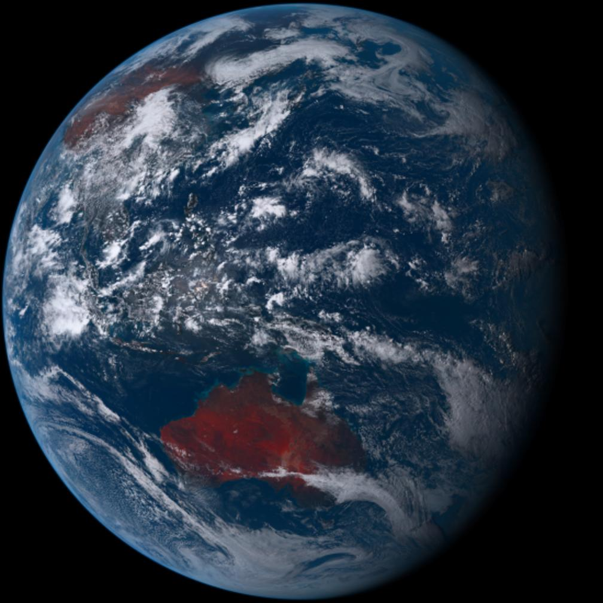
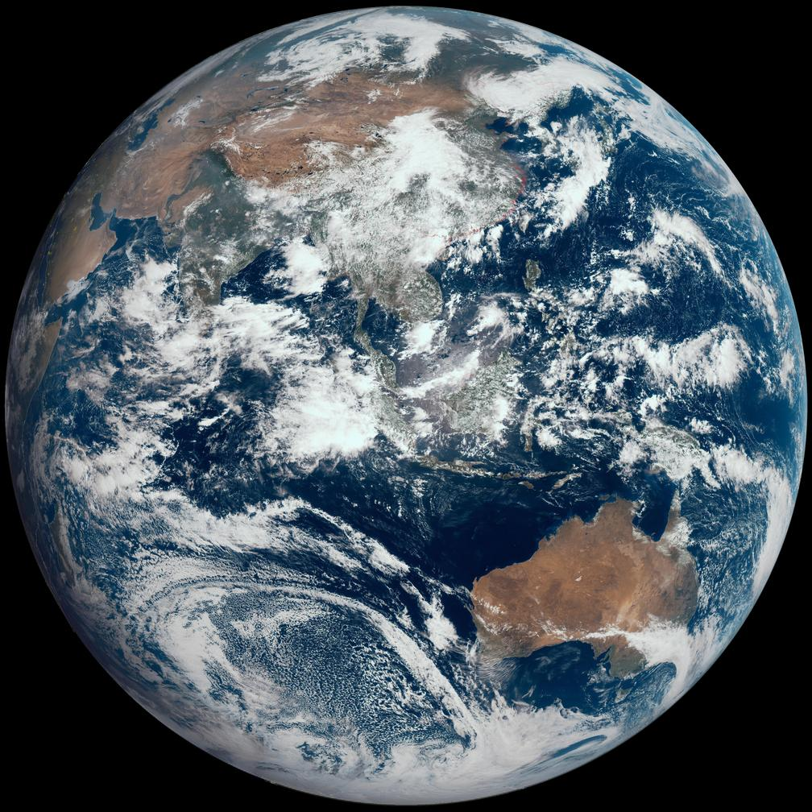
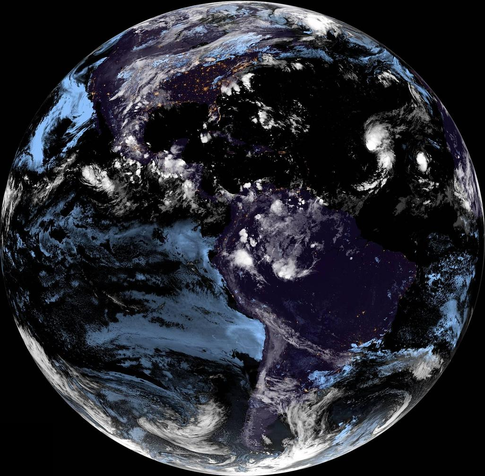
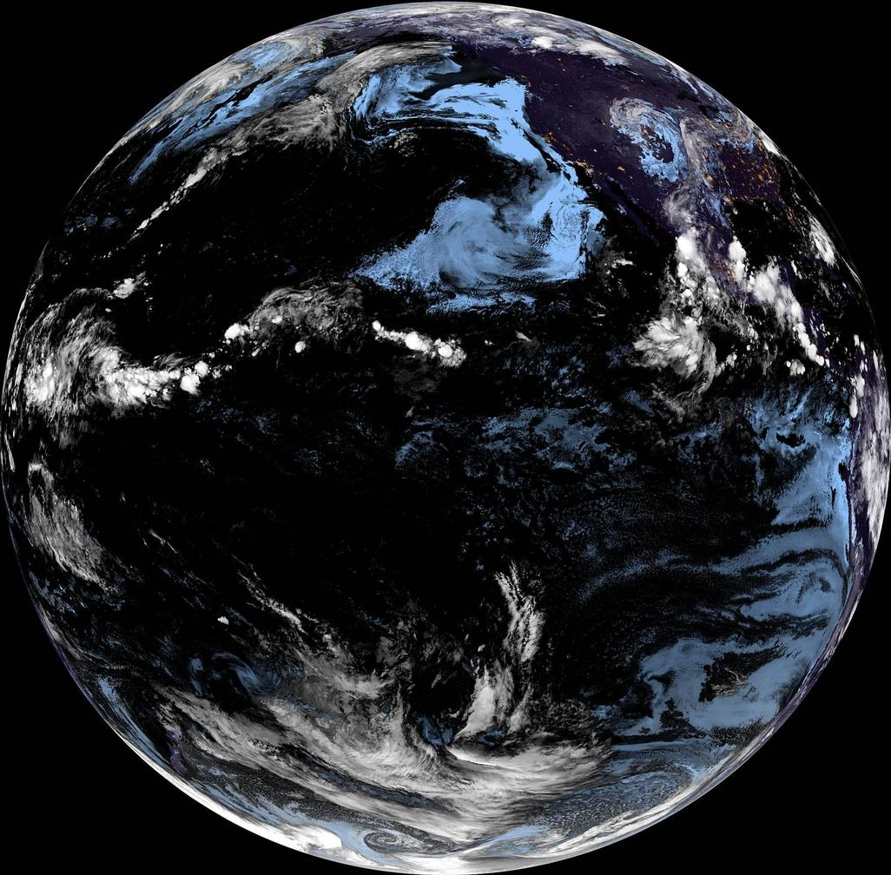

# EarthWallpaper
shell版地球背景,依赖 ImageMagick

# 安装
ubuntu为例
首先安装 ImageMagick,安装过的跳过
```
sudo apt-get install imagemagick bc
```

然后安装程序
```
sudo git clone https://github.com/ghostry/EarthWallpaper.git /opt/EarthWallpaper
ln -s /opt/EarthWallpaper/earthWallpaper.desktop ~/.config/autostart
```

# 卫星选择
```
cd /opt/EarthWallpaper
cp config.ex config
```
编辑 config 中的 第5行 using="himawari8"
有以下卫星可选

## himawari8[向日葵8号]
using="himawari8"



## fy4a[风云4号]
using="fy4a"



## goes16
using="goes16"



## goes17
using="goes17"


